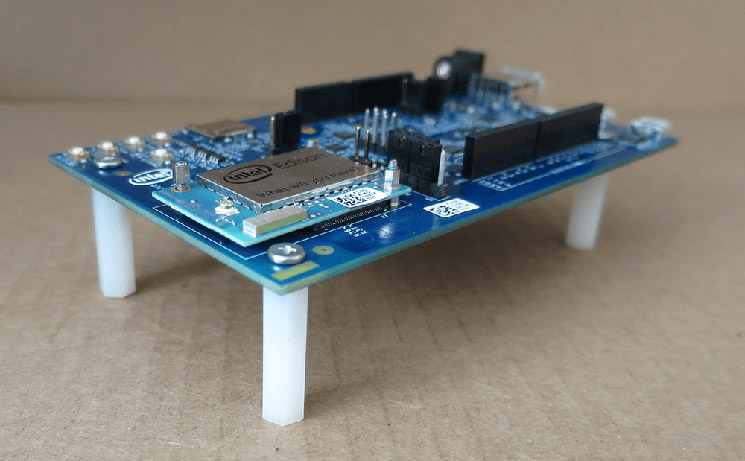
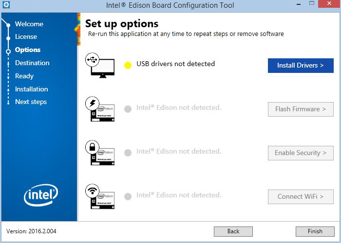

Intel Edison
============
Required Software
-----------------
- Windows
  - [Edison Setup Tool](https://software.intel.com/iot/hardware/edison/downloads)
  - Putty
- Linux
  - [Edison Setup Tool](https://software.intel.com/iot/hardware/edison/downloads)
- Mac
  - [Edison Setup Tool](https://software.intel.com/iot/hardware/edison/downloads)

Setting up the Board
--------------------
Assemble the board as in the picture: install the Edison Compute Module and the plastic seperators.

There is a power supply socket(4), a Type-A USB port and 2 micro USB ports(2, 3) and a switch(1) on the Arduino Expansion Board.

The switch(1) sets the USB mode of Edison. If it's pointing up, towards the Type-A USB port, Edison is in `Host mode` and it gets power from the external power supply. In this case other devices, like a webcam or a sensor, can be connected to it through the Type-A USB port. If the switch is pointing down, towards the micro USB ports, Edison is in `Device mode` and it gets power from the micro USB port(2). In this case it will be recognized by computers as a device.

Micro USB port(2) is used for: 5V power, programming the Edison board using the Arduino IDE, reading/writing to the onboard flash memory from your computer like a disk drive, and/or using Ethernet over USB.

Micro USB port(3) is used for shell access via serial communication.

External DC power supply(4) must provide a voltage between 7-15V and a minimum current of 1500mA.

> Some laptops may not be able to provide enough current to power Edison. Powering it using an external power supply is more stable. However, in this workshop we will Edison through the micro USB port(2).

Make sure that the switch(1) is pointing down, towards the micro USB ports. Connect 2 Micro USB ports(2, 3) to your computer.

Now, the green power LED indicator should light up. If not, check the cables, or use an external power supply.

Once Edison initializes, a new drive named "EDISON" will be mounted to your computer.

Installing the Drivers
----------------------
Drivers should be installed on your computer using [Edison Setup Tool](https://software.intel.com/iot/hardware/edison/downloads)

> Edison Setup Tool can also be used to flash firmware on Edison and configure it. We will cover flashing firmware in section "Building Yocto Linux and Deploying It" and we will configure it in section "Configuring Edison".

Connecting to Edison
--------------------
First, we will connect to Edison over the serial port.

In Windows, open Device Manager.

Configuring Edison
------------------